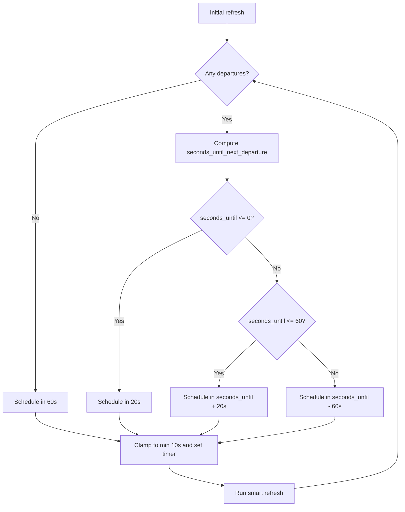

# Smart Departures Strategy

This document describes exactly how the `smart` update strategy schedules API calls.

## Overview

In smart mode, the stop coordinator does **not** use a fixed poll interval.  
It performs one initial refresh, then computes the next API call time from the next known departure.

## Scheduling Logic

After each smart refresh:

1. If there are no departures, schedule next call in `60s`.
2. If next departure is already in the past, schedule next call in `20s`.
3. If next departure is in `<= 60s`, schedule next call at `departure + 20s`.
4. Otherwise, schedule next call at `departure - 60s`.
5. Apply a hard minimum delay of `10s`.

Constants (from code):
- `SMART_PRE_DEPARTURE_SECONDS = 60`
- `SMART_POST_DEPARTURE_SECONDS = 20`
- Minimum scheduled delay: `10`

## Flow

## What One Smart Refresh Calls

A smart refresh (`async_refresh()` / `_async_update_data`) can trigger:

- Always: `stops_schedules.json` (departures)
- On first refresh only: another `stops_schedules.json` call (stop info bootstrap)
- Conditionally: `messages.json` when `messages_refresh_interval` elapsed
- Conditionally: `lines.json?displayOutages=1` when `outages_refresh_interval` elapsed

So one refresh can be:
- 1 call (departures only), or
- 2 to 4 calls depending on first-run state and endpoint-specific refresh intervals.

The manual button entity **Refresh departures** is different:
- In regular/smart modes (or active time windows), it calls departures only (`stops_schedules.json`) once.
- In time-window mode outside active windows, it refreshes departures from GTFS planned data (no realtime API fallback).
- It does not force messages/outages refresh.

## Why You Might See No API Logs

If you expected request logs but see none, check:

1. `Debug mode` must be enabled in Tisseo options.
2. Home Assistant logger level must include `custom_components.tisseo: debug`.
3. Smart mode can intentionally wait a long time if next departure is far away (it refreshes at `T-60s`).
4. In time-window strategy, outside active windows uses GTFS-based departures; if off-window interval is `0`, no polling is expected.

## How To Validate Smart Mode Is Working

1. Check the global usage sensors:
   - `sensor.tisseo_api_calls_total`
   - `sensor.tisseo_api_usage_api_calls_successful`
   - `sensor.tisseo_api_usage_api_calls_failed`
   - `sensor.tisseo_api_usage_api_calls_today`
2. Press the stop `Refresh departures` button once.
3. Confirm `sensor.tisseo_api_calls_total` increases by exactly `+1`.
4. Wait for the next smart schedule point and confirm the counter increases again.
