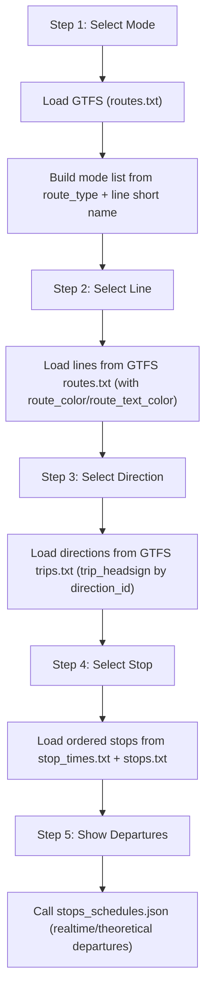
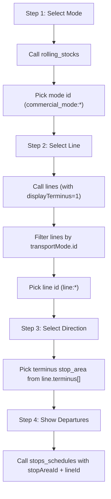
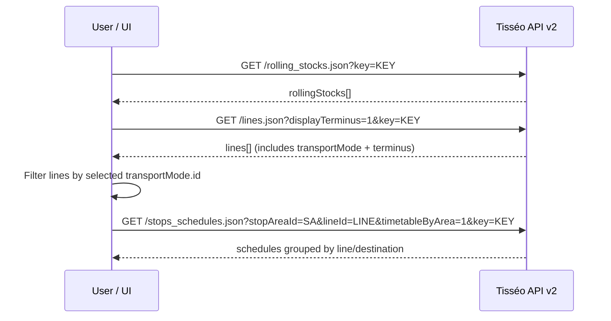

# Tisseo API Reference

Quick reference for the Tisseo public transport API (Toulouse, France) used by this integration.

## Documentation Links

| Resource | URL |
|---|---|
| Open Data Portal (main) | https://data.toulouse-metropole.fr/explore/dataset/api-temps-reel-tisseo/ |
| API v2 Documentation (EN PDF) | https://data.toulouse-metropole.fr/api/datasets/1.0/api-temps-reel-tisseo/images/e063e40de3c514dc1994e0adb1029250 |
| API v2 Documentation (FR PDF) | https://data.toulouse-metropole.fr/api/datasets/1.0/api-temps-reel-tisseo/images/49e228dcbd2c1b82b4c15fcbd18c52d7 |
| API v2 Documentation (alt PDF) | https://data.toulouse-metropole.fr/api/explore/v2.1/catalog/datasets/api-temps-reel-tisseo/files/99ed97783e2ad57c59ece8e60ff4db98 |
| data.gouv.fr listing | https://www.data.gouv.fr/datasets/api-temps-reel-tisseo-real-time-tisseo-api/ |
| Tisseo GitHub org | https://github.com/Tisseo |
| GTFS static data | https://transport.data.gouv.fr/datasets/tisseo-offre-de-transport-gtfs |
| Interactive route planner | https://www.tisseo.fr/en/interactive-map/ |

## Authentication

- **API Key** required on every request via the `key` query parameter.
- Keys are **free** - request by emailing **opendata@tisseo.fr**.
- No self-service portal; email is the only way to get a key.

## Base URL

```
https://api.tisseo.fr/v2/<endpoint>.<format>?<params>&key=<API_KEY>
```

Format: `.json` or `.xml`

## Guided Selection Flow (Mode → Line → Direction → Departures)

This section documents the exact API sequence used to drive the UI flow:

1. Select a transport mode (métro, Linéo, Tramway, Bus, Téléo, …).
2. Select a line for that mode (only show lines that match the selected mode).
3. Select the direction (terminus) for that line.
4. Display real-time departures for the selected line/direction.

## Current Implementation (GTFS-First)

As of the current implementation, the selector hierarchy is **GTFS-first**:

1. Modes from GTFS (`routes.route_type` + line-name mapping for Linéo).
2. Lines from GTFS `routes.txt`.
3. Directions from GTFS `trips.txt` (`direction_id` + `trip_headsign`).
4. Stops from GTFS `stop_times.txt` + `stops.txt`.
5. Departures still from realtime API (`stops_schedules.json`).

If GTFS is temporarily unavailable, the integration falls back to the API-based selectors.



**Flowchart**



**Sequence Diagram**



### Step 1 - Fetch Transport Modes

**Endpoint**

```text
https://api.tisseo.fr/v2/rolling_stocks.json?key=<API_KEY>
```

**Example Response (trimmed)**

```json
{
  "expirationDate": "2014-01-10 03:45",
  "rollingStocks": [
    { "article": "le", "id": "commercial_mode:3", "name": "bus" },
    { "article": "le", "id": "commercial_mode:1", "name": "métro" },
    { "article": "le", "id": "commercial_mode:2", "name": "tramway" }
  ]
}
```

### Step 2 - Fetch Lines (then filter by mode)

**Endpoint**

```text
https://api.tisseo.fr/v2/lines.json?displayTerminus=1&key=<API_KEY>
```

**Filtering rule**

The lines response includes a `transportMode` object. Filter lines to keep only those where:

```
line.transportMode.id == <selected_mode_id>
```

Example: `commercial_mode:1` for métro.

**Example Line (trimmed)**

```json
{
  "id": "line:72",
  "shortName": "21",
  "name": "Basso Cambo / Colomiers Airbus",
  "network": "Tisséo",
  "transportMode": {
    "id": "commercial_mode:3",
    "article": "le",
    "name": "bus"
  },
  "terminus": [
    { "id": "stop_area:SA_206", "cityName": "TOULOUSE", "name": "Basso Cambo" },
    { "id": "stop_area:SA_713", "cityName": "COLOMIERS", "name": "Colomiers Gare SNCF" }
  ]
}
```

### Step 3 - Select Direction (Terminus)

Each line may contain one or more terminus stop areas under `terminus[]`. These are the “direction” choices in the UI.

Pick one `stop_area:SA_*` from the line’s `terminus[]` list.

### Step 4 - Fetch Real-Time Departures

Use `stops_schedules` with the selected terminus stop area and optionally filter by line.

**Endpoint (grouped by line/destination)**

```text
https://api.tisseo.fr/v2/stops_schedules.json?stopAreaId=stop_area:SA_444&lineId=line:143&timetableByArea=1&number=2&key=<API_KEY>
```

**Example Response (trimmed)**

```json
{
  "stopAreas": [
    {
      "name": "Météo",
      "id": "stop_area:SA_444",
      "cityName": "TOULOUSE",
      "cityId": "admin:fr:31555",
      "schedules": [
        {
          "stop": {
            "id": "stop_point:SP_176",
            "name": "Météo",
            "operatorCode": "4601"
          },
          "line": {
            "id": "line:143",
            "shortName": "18",
            "color": "(255,104,9)",
            "bgXmlColor": "#e46809",
            "fgXmlColor": "#FFFFFF",
            "style": "orange",
            "network": "Tisséo",
            "name": "Basso Cambo / Cité Scolaire Rive-Gauche"
          },
          "destination": {
            "id": "stop_area:SA_206",
            "name": "Basso Cambo",
            "cityName": "TOULOUSE",
            "cityId": "admin:fr:31555"
          },
          "journeys": [
            {
              "dateTime": "2014-06-29 16:36:00",
              "realTime": "1",
              "waiting_time": "00:03:05"
            },
            {
              "dateTime": "2014-06-29 16:46:00",
              "realTime": "1",
              "waiting_time": "00:13:20"
            }
          ]
        }
      ]
    }
  ]
}
```

**Notes**

- If `timetableByArea=1`, `realTime` is `0/1` instead of `yes/no`.
- Real-time data is only available for Bus and Tramway; métro is frequency-based.
- The API examples omit the `key` parameter in the official docs, but it is required.

## Endpoints Used by This Integration

### `tisseo-gtfs` (Open Data GTFS ZIP) - Static referential hierarchy

Used first in: `api.py:get_transport_modes()`, `api.py:get_lines()`, `api.py:get_routes()`, `api.py:get_stops()`, `api.py:get_stop_info()`

Files used:

- `routes.txt` (lines + colors + route_type)
- `trips.txt` (direction_id + headsign)
- `stop_times.txt` (ordered stops per direction)
- `stops.txt` (stop names and parent stations)

### `stops_schedules.json` - Real-time departures

Used in: `api.py:get_departures()`, `api.py:get_stop_info()`

Note: for planned window queries with `display_realtime=0`, the integration attempts GTFS-first and falls back to this endpoint when needed.

| Parameter | Description |
|---|---|
| `stopPointId` | Physical stop ID (e.g., `stop_point:SP_1234`) |
| `stopAreaId` | Logical stop area ID (e.g., `stop_area:SA_206`) |
| `stopsList` | Advanced filter: `<stop>|<line>|<destination_stop_area>` (can specify direction explicitly) |
| `lineId` | Filter by line |
| `datetime` | Start datetime for schedule query (`YYYY-MM-DD HH:MM`) |
| `number` | Max results (default 10) |
| `displayRealTime` | `1` for real-time values, `0` for theoretical timetable |
| `timetableByArea` | Set to `1` to group by stop area |

**Note:** Real-time data only for Bus and Tramway. Metro uses frequency-based schedules.

### `lines.json` - Lines and transport modes

Used in: fallback for `api.py:get_lines()`, fallback for `api.py:get_routes()`, `api.py:get_outages()`, `api.py:_get_lines_for_stop()`

| Parameter | Description |
|---|---|
| `lineId` | Get specific line details (includes routes) |
| `stopAreaId` | Get lines serving a specific stop |
| `shortName` | Filter by line short name (e.g., A, T1, 21) |
| `displayTerminus` | Include terminus stop areas for each line (0/1) |
| `displayMessages` | Include line disruption messages (0/1) |
| `displayOutages` | Include elevator/escalator outages (0/1) |
| `displayOnlyDisrupted` | Only return lines with active disruptions (0/1) |
| `displayGeometry` | Include WKT geometry (0/1) |
| `contentFormat` | Message format (`text` or `html`) |

### `stop_points.json` - Physical stops

Used in: fallback for `api.py:get_stops()`

| Parameter | Description |
|---|---|
| `lineId` | Filter stops by line |
| `routeId` | Filter stops by route |
| `displayCoordXY` | Set to `true` to include coordinates |
| `displayDestinations` | Set to `1` to include destinations[] per stop point |

**Response structure (trimmed)**

```json
{
  "physicalStops": {
    "physicalStop": [
      {
        "id": "stop_point:SP_1234",
        "name": "Météo",
        "stopArea": {
          "id": "stop_area:SA_444",
          "name": "Météo",
          "cityName": "TOULOUSE"
        },
        "destinations": [
          { "id": "stop_area:SA_206", "name": "Basso Cambo", "cityName": "TOULOUSE" }
        ]
      }
    ]
  }
}
```

**Direction filtering:** Each physical stop serves specific directions. The `destinations[]`
array lists the terminus stop_areas reachable from that stop pole. To get only stops
on the correct side of the road for a given direction, filter where `destinations[]`
contains the selected terminus ID.

### `messages.json` - Service alerts/disruptions

Used in: `api.py:get_messages()`

| Parameter | Description |
|---|---|
| `lineId` | Filter by line |

### `places.json` - Geocoding / nearby stops

Used in: `api.py:search_stops()`, `api.py:get_nearby_stops()`

| Parameter | Description |
|---|---|
| `term` | Search query |
| `x` / `y` | Longitude / Latitude |
| `srid` | Coordinate system (default: 4326/WGS84) |
| `number` | Max results |
| `displayOnlyStopAreas` | Set to `1` to filter stop areas only |

## All Available Endpoints (not all used by this integration)

| Endpoint | Description |
|---|---|
| `stops_schedules` | Real-time departure schedules |
| `journeys` | Journey planning (A to B) |
| `places` | Location / geocoding search |
| `lines` | Lines and disruptions |
| `stop_areas` | Logical stop groupings |
| `stop_points` | Physical stop poles |
| `rolling_stocks` | Transport modes |
| `messages` | Network alerts |
| `networks` | Available transport networks |
| `services_density` | Service density around a location |

## Key Behaviors

- When the API returns a single item instead of an array, it returns a dict instead of a list (the code handles this with `isinstance(x, dict)` checks).
- **`destination` in departures is an ARRAY, not a dict.** Each departure's `destination` field is `[{"id": "stop_area:SA_213", "name": "Ramonville", ...}]` — always a list even with one item. Must index `[0]` before calling `.get()`.
- `realTime` field: `"yes"/"no"` in normal mode, `0/1` when `timetableByArea=1`.
- Datetime format: `YYYY-MM-DD HH:MM:SS` (no timezone, always Europe/Paris).
- All IDs are strings (may look numeric but format can change).
- No documented rate limits, but Tisseo monitors per-key usage.
- License: ODbL (Open Database License).
